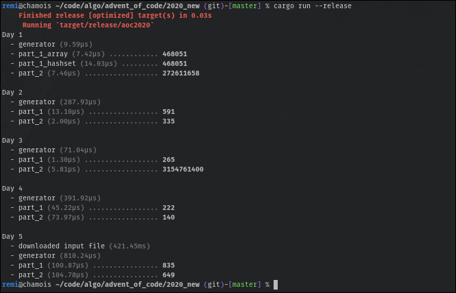

Advent of Code helper
=====================

This crate provides a macro to generate a handful main for your [advent of
code][1] participation. The intention is to provide something similar to
[cargo-aoc][2] through a much simple code base.



Currently this will only provide a few benefits:

  - a somewhat pretty orchestration of your solutions
  - automatic download and loading of your input files
  - generation of criterion benchmarks


Usage
-----

The generator and solutions for a given day must be implemented in a module
called `dayX`. Then you can simply invoke the `aoc_main::main!` macro in your
`main.rs`:

```rust
mod day1 {
    pub fn generator(input: &str) -> Vec<u64> {
        input
            .lines()
            .map(|line| line.parse().unwrap())
            .collect()
    }

    pub fn part_1(input: &[u64]) -> u64 {
        input.iter().map(|&mass| mass / 3 - 2).sum()
    }

    pub fn part_2(input: &[u64]) -> u64 {
        fn total_needed_mass(obj: u64) -> u64 {
            if obj < 9 {
                0
            } else {
                let obj_mass = obj / 3 - 2;
                obj_mass + total_needed_mass(obj_mass)
            }
        }

        input.iter().copied().map(total_needed_mass).sum()
    }
}

mod day2;
mod day3;

aoc_main::main! {
    year 2019;
    day1 : generator => part_1, part_2;
    day2 : generator => part_1, part_2, part_2_optimized;
    day3             => part_1, part_2; // no generator, a &str is passed
}
```

Then you can simply run `cargo run`!

Note that your solutions must take a borrowed version of the generator's
output. Also, the generator can output a structure that contains borrowed data
from the original input file.


Benchmarks
----------

You can run Criterion benchmarks by running `cargo run --release -- --bench`,
but first you need to enable the `bench` feature in your *cargo.toml*:

```toml
[dependencies]
aoc-main = { version = "*", features = ["bench"] }
```


Fetching your AOC token
-----------------------

When the command line asks you for your session token, you can apply the
following procedure (quoted from [cargo-aoc][2]):

  - Firefox: "Storage" tab, Cookies, and copy the "Value" field of the session
    cookie.
  - Google Chrome / Chromium: "Application" tab, Cookies, and copy the "Value"
    field of the session cookie.

If you wish to change or forget your connection token, you will have to remove
`aoc` in your config directory (eg. `$HOME/.config/aoc` for linux users).


[1]: https://adventofcode.com
[2]: https://github.com/gobanos/cargo-aoc
